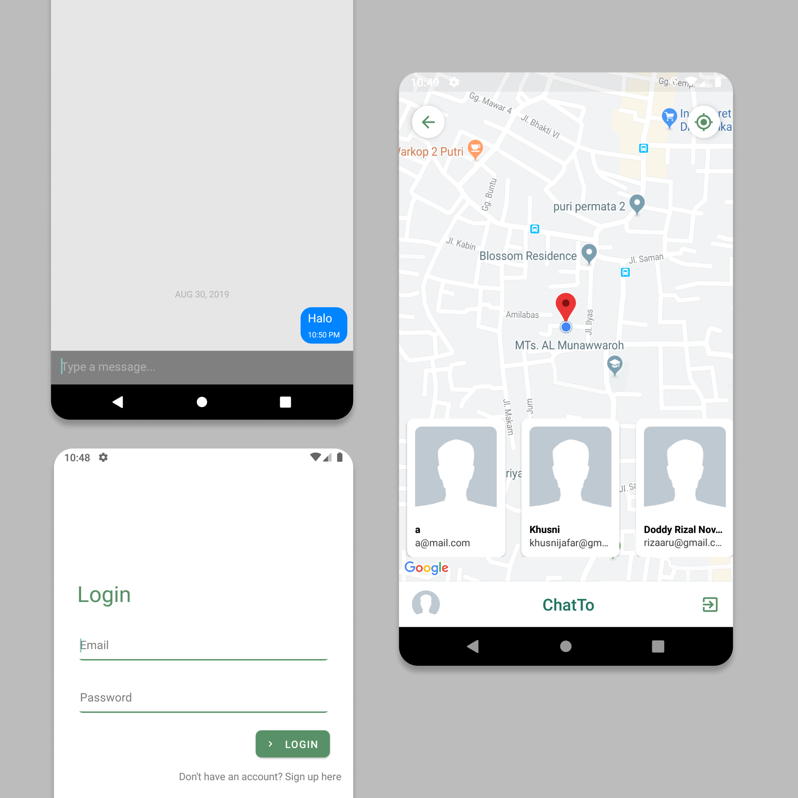

    <h1>ChatTo</h1>

https://drive.google.com/open?id=10s8VKm5ZoUtJyamWKybgGiKnCzWongRD

## Table of Contents

- [Table of Contents](#table-of-contents)
- [Introduction](#introduction)
- [Features](#features)
- [Requirements](#requirements)
- [Usage](#usage)
- [Screenshot](#screenshot)
- [GIF](#gif)

## Introduction

ChatTo is an app to chat and see the location from of our friends, so we can know where exactly our friend.

## Features

- Chatting.
- See friends in maps.

## Requirements

- `npm`
- `react-native-cli`

## Usage

- Clone or download this repo first
- Open your terminal or cmd and type `npm install` and `react-native link`
- After that, run backend first
- Connect your phone to the pc or laptop and make sure your phone is connected with debugging mode
- Finnaly, type `react-native run-android` and wait for the process to complete

## Screenshot

## GIF

